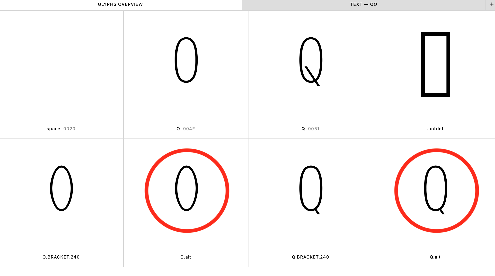

# fontmakeVFtest
Testing why fontmake does not drop non-exporting glyphs in a  variable font in a Glyphs - UFO & designspace - Fontmake workflow.
 
## Workflow

### Navigate to the root directory
```
cd [folder location]
```

### Set up a virtual environment in the root directory

```
virtualenv -p python3 venv
```

### Activate the virtual environment

```
source venv/bin/activate
```

### Install requirements

```
pip install -U -r requirements.txt
```

### Navigate to /production
Assuming you are already in the root directory

```
cd production
```

### Build designspace file in /master_ufo
**Note:** At this stage we want to produce a designspace document and the required UFO's. We want to patch a custom set of Rules (`merge.designspace` found in `/helpers` folder), which create a more complex susbtitution scheme than Glyphs can produce with the bracket layers. The build scripts produces the required UFO and designspace which is afterwards patched using a small python script (`designspace.py`) to substitute the Rules with the new Rules.

```
sh build_ds.sh
```

### Build Variable font

```
sh build_vf.sh
``` 

## Observations

### Expected behaviour
The glyphs O.alt and Q.alt that are flagged as non-exporting in Glyphs should not be included in the final variable font.
The designspace document contains the public.skipExportGlyphs key with the list of glyphs that supposedly should get rid of them.

### Observed behaviour



The non-exporting glyphs are still in the font. 

Possible solutions that did not work:
- --no-write-skipexportglyphs argument in the build_ds
- --subset argument in the build_ds and build_vf
- remove/include the Export Glyphs and Remove Glyphs custom parameters in Glyphs.
